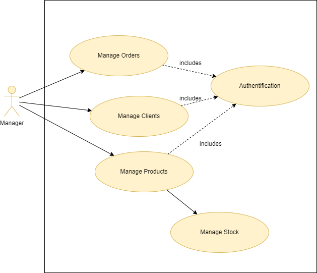
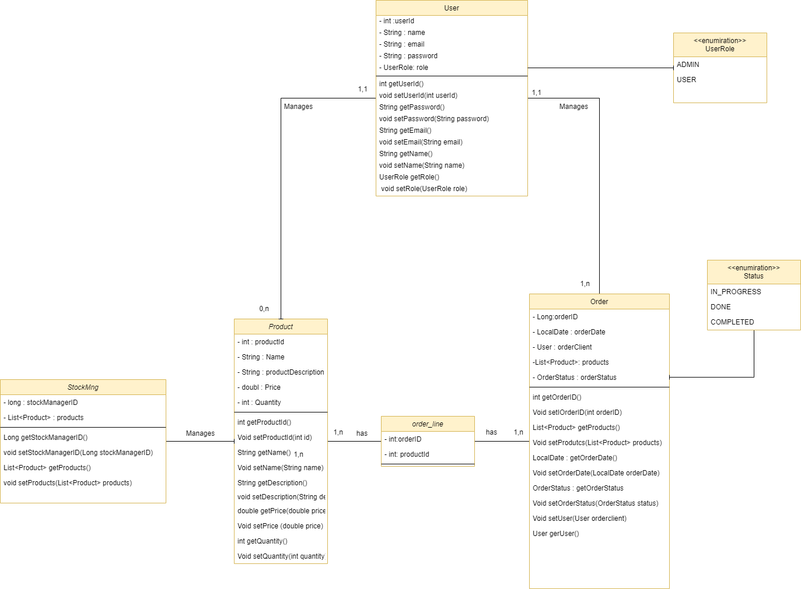
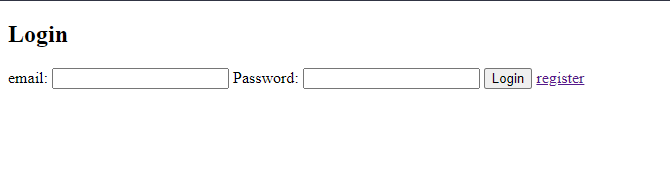
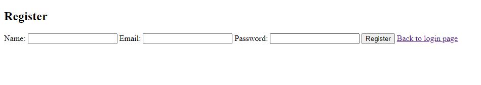
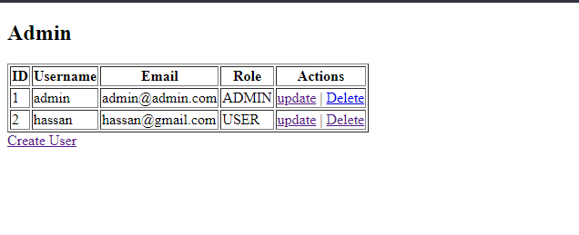
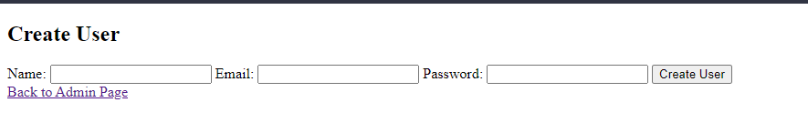
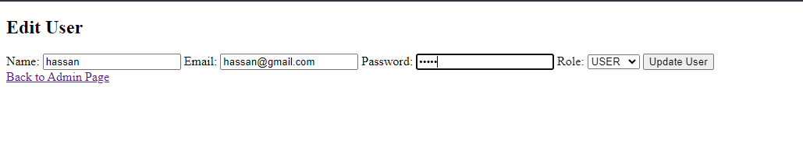

<h1 align="center">
  OrderCraft Spring Application
</h1>

  

## 📝 Table of Contents
- [Description](#description)
- [Project Goals](#project-goals)
- [Soft Skills](#soft-skills)
- [Conception](#conception)
- [Tools Used](#tools-used)
- [Screenshots](#screenshots)

## 🧐 Description 
The OrderCraft Spring Application is a web-based user management system built with . It provides functionalities for creating, editing, and deleting users with role-based access control. The application aims to simplify user management for administrative purposes.

## 🎯 Project Goals 
The primary goals of the project include utilizing various Spring concepts and design patterns. Here's a list of key concepts and patterns employed:

1. Spring MVC architecture
2. Thymeleaf templating engine
3. Spring Data JPA for database interaction
4. CRUD operations for user management
5. inversion of control
6. dependency injection
7. beans

## 🤝 Soft Skills 
This project helped me get this soft skills:

- Time Management
- Problem Solving
- handling stress
  

## 📝 Conception 
### Use Case Diagram

### Class Diagram

### Main features of the application:
- User creation, editing, and deletion
- Role-based user management (Admin, User)
- ...

## 🛠️ Tools Used 
- IntelliJ IDEA
- Git
- GitHub
- xampp
- tomcat7
- draw.io

## 📸 Screenshots 

